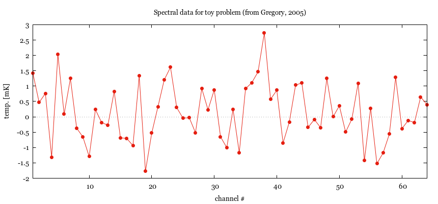
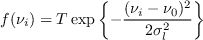
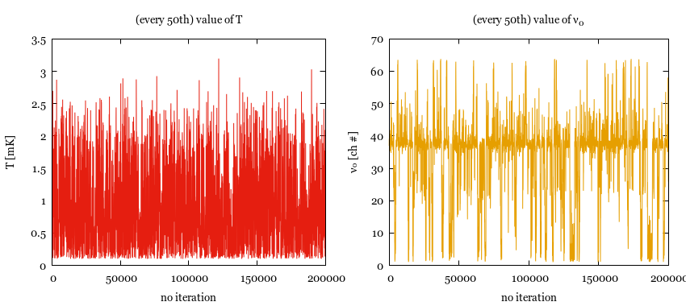
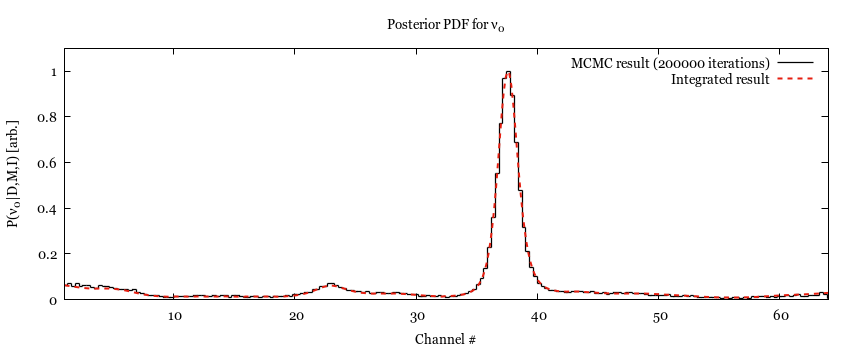
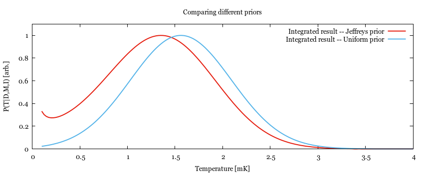
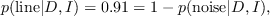
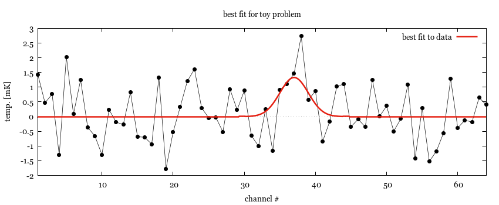

# Table of Contents

1.  [Bayesian Analysis](#org24134b2)
    1.  [Toy problem, setup](#org9085358)
    2.  [Toy problem, model definition](#org246f7e5)
    3.  [Toy problem, generating distributions](#org70739d7)
    4.  [Toy problem, model selection](#org721b6fb)
    5.  [Toy problem, result](#org56571a5)
    6.  [Useful functions](#org1da2eec)

# Bayesian Analysis

This is a lisp package to specify a model and calculate posterior distributions as well as
odds ratios using Bayesian statistics, most notably a simple implementation of the
Metropolis-Hastings algorithm. It is based on Gregory's excellent book on the topic <a id="fnr.1" class="footref" href="#fn.1">1</a>
of Bayesian data analysis.

## Toy problem, setup

That being said, let's say you have some spectral line data (this problem is a modified
version of a problem from <a id="fnr.1.100" class="footref" href="#fn.1">1</a>, Chapter 3) and want to answer some questions about
it. So, first we load *bayesian-analysis* and define a package to work in <a id="fnr.2" class="footref" href="#fn.2">2</a>.

    ;; (ql:quickload :bayesian-analysis)
    (ql:quickload :let-plus)
    (ql:quickload :iterate)
    (ql:quickload :infix-math)
    
    (defpackage #:bayesian-example
      (:use :cl :iterate :let-plus :infix-math))

Then, let's define the working directory; this needs to be adjusted for other directory
structures, of course.

    (in-package :bayesian-example)
    ;; set to my copy of the repository to be able to easily create this document (mainly the
    ;; plots)
    (defparameter *dir* "/home/renee/phd/src/penning-analysis.project/bayesian-analysis/")

Then, define the data to work as given in <a id="fnr.1.100" class="footref" href="#fn.1">1</a>:

    (in-package :bayesian-example)
    (defparameter example-data
      '((1 1.42) (2 0.468) (3 0.762) (4 -1.312) (5 2.029) (6 0.086) (7 1.249) (8 -0.368)
        (9 -0.657) (10 -1.294) (11 0.235) (12 -0.192) (13 -0.269) (14 0.827) (15 -0.685) (16 -0.702)
        (17 -0.937) (18 1.331) (19 -1.772) (20 -0.53) (21 0.33) (22 1.205) (23 1.613) (24 0.3)
        (25 -0.046) (26 -0.026) (27 -0.519) (28 0.924) (29 0.23) (30 0.877) (31 -0.65) (32 -1.004)
        (33 0.248) (34 -1.169) (35 0.915) (36 1.113) (37 1.463) (38 2.732) (39 0.571) (40 0.865)
        (41 -0.849) (42 -0.171) (43 1.031) (44 1.105) (45 -0.344) (46 -0.087) (47 -0.351) (48 1.248)
        (49 0.001) (50 0.36) (51 -0.497) (52 -0.072) (53 1.094) (54 -1.425) (55 0.283) (56 -1.526)
        (57 -1.174) (58 -0.558) (59 1.282) (60 -0.384) (61 -0.12) (62 -0.187) (63 0.646) (64 0.399)))

And plot it to take a look at it (for the definition of plot see [1.6](#org1da2eec)):

    (in-package :bayesian-example)
    (plot (:file-name "example/just-plot.png" :size "860,400")
    
        ("set xlabel 'channel #'" "set ylabel 'temp. [mK]'"
         "set xrange [1:64]" "set xzeroaxis"
         "set title 'Spectral data for toy problem (from Gregory, 2005)'")
      (example-data "with points pt 7 lc 7 title ''")
      (example-data "with lines lc 7 title ''"))

Now, some of the questions we (might) wanna answer are: given the data, what is the
likelihood of a signal at channel with &nu;\_0=37 and compare it to the likelihood of
everything being noise.

But to do some analysis on it with the *bayesian-analysis* package, we first need to cast
the data into a form the library understands:

    (in-package :bayesian-example)
    
    (ba:define-data-class toy-data (ch "channel number") (mK "temperature") () (obj (source list))
      (let ((dim (length source)))
        (setf ch (make-array dim :element-type 'double-float)
    	  mK (make-array dim :element-type 'double-float))
        (iter
          (for (x y) in-sequence source with-index i)
          (setf (aref ch i) (coerce x 'double-float)
    	    (aref mK i) (coerce y 'double-float)))))

*ba:define-data-class* is a convenience macro that defines a subclass of *ba:data* and the
methods (interface in OOP parlance) necessary to use it - specifically a method to
initialize an object of type *toy-data* from a simple list of the form *{x, y}\**.

## Toy problem, model definition

Gregory specifies two models that he compares to each other, one where it is assumed that
there is **no line** in the data, and one where we assume there is a **line** with the following
shape:

Where it is assumed that the line has a width of &sigma;\_l=2ch and the line is predicted to
appear in the spectrum at around &nu;\_0=37. Furthermore, all channel are subject to
Gaussian noise specified to have standard deviation of &sigma; = 1mK.

To express the model that describes a line in the data using *bayesian-analysis*, we simply
write:

    (in-package :bayesian-example)
    
    (ba:define-bayesian-model (line toy-data)
        ((Τ :default 2 :prior :jeffreys :marginalize t :min 1e-1 :max 100 :sample-sigma 0.5)
         (ν₀ :default 37 :min 1 :max 64 :sample-sigma 2.5)
         (σₗ :default 2))
        (:d_i=f_i+gaussian_error_1_equal_sigma :equal-sigma-parameter (sigma :default 1))
        ((νᵢ) ($ Τ * (exp (- (νᵢ - ν₀) ^ 2 / (2 * σₗ ^ 2))))))

The model definition also specifies a choice of priors and their ranges. Here T is a scale
parameter and best described using a Jeffreys prior (see below), the rest are uniform
priors (the default). Parameter T, the signal strength, is unknown and marginalized over
by default. The defintion of the model also specifies default values for the MCMC
samplers. All of the settings, however, can be overwritten when instantiating a model
object. We also specifiy that all data is assumed to have an error distribution that
follows a gaussian (by specifying *:d\_i=f\_i+gaussian\_error\_1\_equal\_sigma*) with &sigma;=1.
Finally, f(&nu;\_i) is defined, where $ is a macro provided by *infix-math*.

## Toy problem, generating distributions

With these definitions in place, we can easily generate posteriors for the parameters
using the Metropolis-Hastings algorithm and as we first might wanna see the posterior for
the center frequency &nu;\_0, we enable marginalization over &nu;\_0:

    (in-package #:bayesian-example)
    
    (defparameter *mcmc-result* (ba:find-optimum (make-instance 'ba:metropolis-hastings :no-iterations 200000)
    					     (make-instance 'line :ν0-marginalize t)
    					     (ba:initialize-from-source 'toy-data example-data)))

Let's have a look at the sampled values for T and &nu;\_0:

    (in-package #:bayesian-example)
    (plot (:multiplot "layout 1,2" :file-name "example/sampled-values.png" :size "850, 380") ()
      ((ba:get-iteration-value-data *mcmc-result* 'Τ :every 50) "with lines lc 7 title ''"
       "set title '(every 50th) value of T'"
       "set xlabel 'no iteration'" "set ylabel 'T [mK]'")
      ((ba:get-iteration-value-data *mcmc-result* 'ν₀ :every 50) "with lines lc 4 title ''"
       "set title '(every 50th) value of ν_0'"
       "set ylabel 'ν₀ [ch #]'"))

This seems alright, so let's see what the PDF for &nu;\_0 looks like and compare it to the
result arrived at when numerically integrating over the marginalized parameters (using
*ba:parameter-pdf-integrate* which works only for a small number of parameters due to
limitations &#x2013; i.e. not using arbitrary precision &#x2013; of the used GNU scientific library
integration routine):

    (in-package #:bayesian-example)
    (let+ ((p-res (ba:get-parameter-results *mcmc-result* :start 2000 :no-bins 200))
           ((&slots ba:binned-data) (ba:get-parameter-info p-res 'ν₀)))
      (plot (:file-name "example/nu0.png" :size "850,350")
          ("set title 'Posterior PDF for ν_0'"
           "set yrange [0:1.1]"
           "set xrange [1:64]"
           "set xlabel 'Channel #'"
           "set ylabel 'P(ν_0|D,M,I) [arb.]'")
        ((normalize-to-one ba:binned-data)
         "with histeps lc 0 lw 1.25 title 'MCMC result (200000 iterations)'")
        ((normalize-to-one
          (ba:parameter-pdf-integrate '(ν₀ 1 64) 400 '((Τ 0.1 100))
    				  (make-instance 'line)
    				  (ba:initialize-from-source 'toy-data example-data)))
         "with lines lc 7 lw 2 dt '-' title 'Integrated result'")))

Seems reasonable and agrees (visually) with Gregory. Next, we investigate the effect of
different types of prior and how this can be accomplished using the *bayesian-analysis*
package (again following the script set by Gregory). The temperature *T* is a scale
parameter which is why we modeled it using a Jeffreys prior; it is very easy to change
that, though:

    (in-package :bayesian-example)
    
    
    (let+ ((data (ba:initialize-from-source 'toy-data example-data)))
      (plot (:file-name "example/prior-type.png" :size "850,350")
          ("set yrange [0:1.1]"
           "set xrange [0:4]"
           "set title 'Comparing different priors'"
           "set xlabel 'Temperature [mK]'"
           "set ylabel 'P(T|D,M,I) [arb.]'")
        ((normalize-to-one
          (ba::parameter-pdf-integrate '(Τ 1d-1 5d0) 200 nil 
    				   (make-instance 'line) data))
         "with lines lc 7 lw 2 dt 1 title 'Integrated result -- Jeffreys prior'")
        ((normalize-to-one
          (ba::parameter-pdf-integrate '(Τ 1d-1 5d0) 200 nil
        				   (make-instance 'line :Τ-prior :uniform) data))
         "with lines lc 3 lw 2 dt 1 title 'Integrated result -- Uniform prior'")))

This also lines up well with expectations and Gregory's analysis. 

## Toy problem, model selection

Now for the actual question. Does the data support the theory that there is a line at
channel 37 with a &sigma;\_l=2 or is the peak in that area just a noise eartefact. To answer
that question, we need to define a simple noise model:

    (in-package :bayesian-example)
    (ba:define-bayesian-model (noise toy-data) ()
        (:d_i=f_i+gaussian_error_1_equal_sigma
         :equal-sigma-parameter (sigma :default 1))
        ((x) 0))

The *noise* model specifies that the expected intensity is zero everywhere and the noise
parameters are the same as before. With that in place, we can calculate the odds ratio
easily:

    (in-package :bayesian-example)
    
    (let+ ((data (ba:initialize-from-source 'toy-data example-data))
           (L-M1 (ba:calculate-marginal-posterior (make-instance 'line) data '((Τ 0.1 100))))
           (L-M2 (ba:calculate-marginal-posterior (make-instance 'noise) data '()))
           (odds (/ L-M1 L-M2)))
      (format nil "~,3f" ($ 1 / (1 + 1 / odds)) 'single-float))

    0.913

The probabilities, given the data, for the different theories are therefore:

as expected from Gregory's discussion.

## Toy problem, result

Given that the data indicates a line in the spectrum with 91% probability, the last thing
to do is to plot the most likely version of it (best fit):

    (in-package #:bayesian-example)
    
    (let+ ((data (ba:initialize-from-source 'toy-data example-data))
           (p-res (ba:get-parameter-results
    	       (ba:find-optimum (make-instance 'ba:metropolis-hastings :no-iterations 20000)
    				(make-instance 'line) data)))
           ((&slots ba:model) p-res)
           (fun (ba:get-1d-plot-function ba:model)))
      (plot (:file-name "example/best-fit.png" :size "850,350")
          ("set xlabel 'channel #'" "set ylabel 'temp. [mK]'"
           "set xrange [1:64]" "set xzeroaxis"
           "set title 'best fit for toy problem")
        (example-data "with points pt 7 lc 0 title ''")
        (example-data "with lines lw 0.7 lc 0 title ''")
        ((iter
           (for nu from 0 to 64 by 0.1)
           (collect (list nu (funcall fun nu))))
         "with lines lc 7 lw 2.5 title 'best fit to data'")))

## Useful functions

Let us define a plot macro to make life a bit easier:

    (in-package :bayesian-example)
    (defmacro plot ((&key file-name
    		      (terminal-options "enhanced font 'Georgia,10' dashed")
    		      ;; this seems to be a good value for github
    		      (size "860,450")
    		      multiplot)
    		(&rest other-gnuplot-commands)
    	&body data/options)
      (labels ((parse-cmds (cmds)
    	     (iter
    	       (for c in cmds)
    	       (typecase c
    		 (string (collect `(cmd ,c)))
    		 (list (collect `(cmd ,@c)))
    		 (t (error "Do not know how to handle command: ~a" c))))))
        `(labels ((cmd (fmt-str &rest args)
    		(mgl-gnuplot:command (apply #'format nil fmt-str args))))
           (mgl-gnuplot:with-session ()
    	 (cmd "reset")
    	 ,@(if file-name
    	       `((cmd "set output '~a/~a'" ,*dir* ,file-name)
    		 (cmd "set terminal pngcairo size ~a ~a" ,size ,terminal-options))
    	       `((cmd "set terminal wxt ~a" ,terminal-options)))
    	 ,@(when multiplot (typecase multiplot
    			     (string `((cmd "set multiplot ~a" ,multiplot)))
    			     (t (error "Need to specify multiplot options."))))
    	 ,@(parse-cmds other-gnuplot-commands)
    	 ,@(if multiplot
    	       (iter
    		 (for data/opt in data/options)
    		 (let+ (((data opt &rest other-cmds) data/opt))
    		   (for options = (if opt opt "with lines lc 0 title ''"))
    		   (appending (parse-cmds other-cmds))
    		   (appending
    		    `((mgl-gnuplot:plot* (list (mgl-gnuplot:data* ,data ,options)))))))
    	       `((mgl-gnuplot:plot*
    		  (list
    		   ,@(iter
    		       (for (data opt) in data/options)
    		       (for options = (if opt opt "with lines lc 0 title ''"))
    		       (collect `(mgl-gnuplot:data* ,data ,options)))))))
    	 ,@(when multiplot `((cmd "unset multiplot")))
    	 (cmd "unset output"))
           (format t "~a" ,file-name))))

And also a normaliztion function:

    (in-package :bayesian-example)
    (defun normalize-to-one (x/y-s)
      (let+ ((max (reduce #'max x/y-s :key #'second)))
        (mapcar #'(lambda (x/y) (list (first x/y) (/ (second x/y) max))) x/y-s)))

# Footnotes

<a id="fn.1" href="#fnr.1">1</a> *Bayesian Logical Data Analysis for the Physical Sciences*, Cambridge University
Press, 2005, <https://doi.org/10.1017/CBO9780511791277>

<a id="fn.2" href="#fnr.2">2</a> Within a properly setup emacs + slime or sly, and given that quicklisp knows about
bayesian-analysis using for example <https://github.com/deepestthought42/with-project-dir>,
this org-mode file can be executed directly. Which is the way I like to do reproducible
research.
